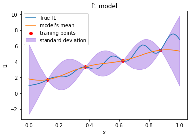
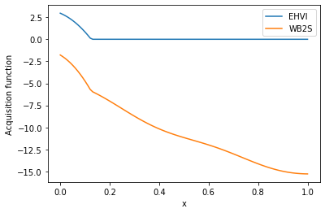

# smoot

## Installation
<code>
  git clone git@github.com:RobinGRAPIN/smoot.git
</code>

Necessary packages : <code>pymoo</code>,<code>smt</code>

## Description

This surrogate based multi-objective Bayesian optimizer has been created to see the performance of the WB2S criterion adapted to multi-objective problems.
Given a black box function f : **x** -> **y** with **bolds** characters as vectors, <code>smoot</code> will give an accurate approximation of the optima with few calls of f.

### Utilisation

Look at the Jupyter notebook in the *tutorial* folder.

You will learn how to use implemented the functionnalities and options such as :
 - The choice of the infill criterion
 - The method to manage the constraints

For additional questions, contact: robingrapin@orange.fr
